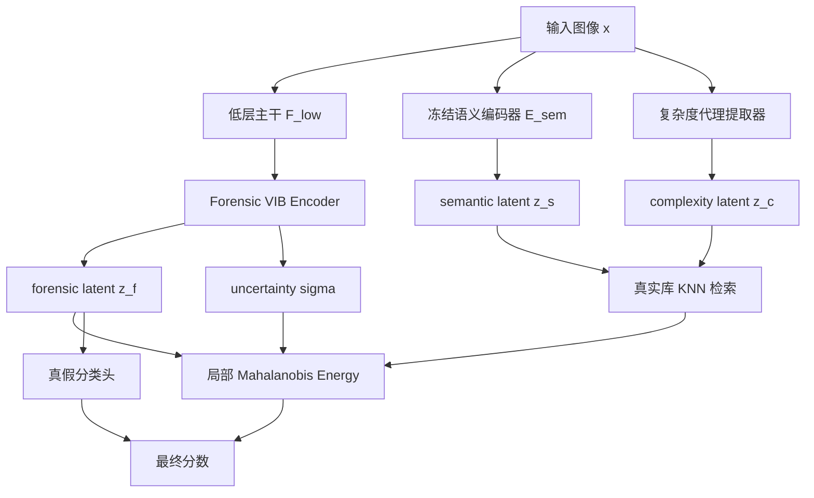
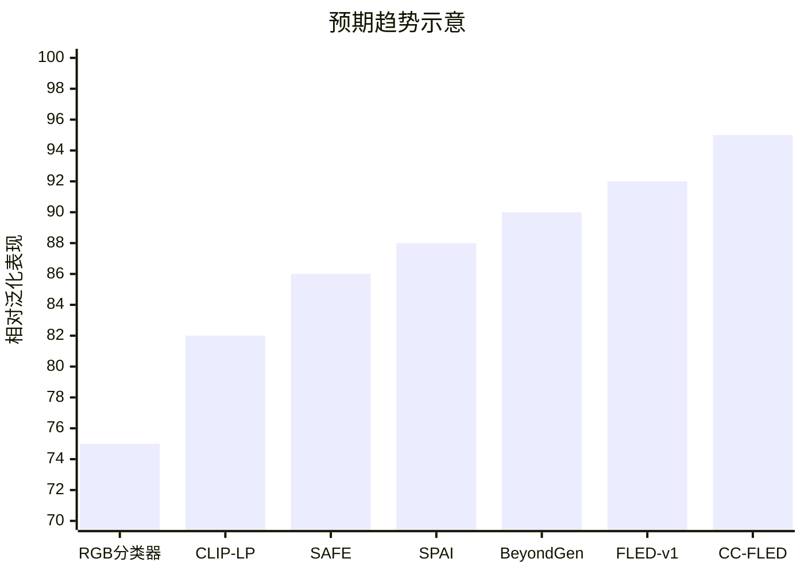
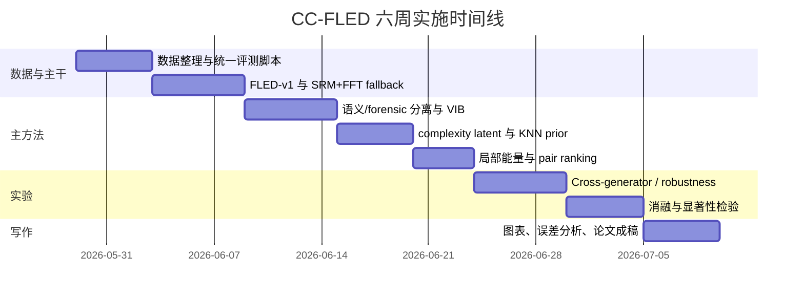

# 基于隐空间分离与可比性的 SOTA 级 AIGC 图像检测研究路线

## 执行摘要

这份报告的核心结论是：如果目标是把你当前“forensic latent + energy”思路推进到**接近或达到当前公开基准上的 SOTA 水平**，最清晰、最有说服力、也最可复现的主线，不应该是把各种强方法机械拼成“大锅炖”，而应当把你已经提出的 FLED 骨架升级为一个更严格的版本：**复杂度条件化、可比性驱动的隐空间分离检测器**。换句话说，我们不再假设“真实图像在低层 forensic latent 上服从单一稳定分布”，而是提出更精确的假设：**在语义和图像复杂度可比的条件下，真实图像会落在一个局部、条件化的真实低层流形附近；AIGC 图像则在这个局部流形的非语义 forensic 子空间上系统性偏离。** 这条故事线同时吸收了你上传草案中的 FLED、Mahalanobis energy、pairwise ranking 和 low-level extractor 思路，但把它从“全局自然性建模”升级到了“条件化局部自然性建模”。 fileciteturn0file0

文献证据非常一致地支持这条升级方向。近两年的检测工作一方面表明，**语义偏置、内容偏置、分辨率/压缩偏置**是 cross-generator 失效的关键原因，单纯二分类器很容易学到 semantic shortcut；另一方面也表明，**真实图像的低层统计、频谱分布、重建行为、扰动鲁棒性**确实比“fake 类的枚举式学习”更有泛化潜力。代表性的证据来自 Breaking Semantic Artifacts、B-Free、DDA、VIB-Net、SemAnti、GSD、MPFT 等关于语义偏置抑制的工作，以及 Beyond Generation、SPAI、ZED、DIRE、AEROBLADE、HFI、RIGID 等关于真实分布建模、重建误差、频谱和扰动鲁棒性的工作。citeturn7academia0turn2view0turn43view1turn32academia2turn41academia3turn35academia0turn44view0turn14academia0turn18academia2turn36academia1turn36academia0turn36academia2turn2view1

因此，我建议将最终主方法定义为 **CC-FLED**：**Complexity-Conditioned Comparable Forensic Latent Energy Detector**。它保留你原方案中最有生命力的部分——低层特征、随机 latent、energy、pairwise ranking——但增加两个决定性部件：其一是**语义/forensic 分离**，其二是**复杂度条件化的局部可比性检索与局部能量估计**。这两点正是把“好想法”推进到“SOTA 级故事线”的关键。citeturn43view1turn44view0turn7academia0turn1academia0turn32academia2turn41academia3turn42academia2

## 问题重述与核心理论假设

AIGC 图像检测之所以长期难以真正泛化，不是因为缺少一个更大的 backbone，而是因为很多方法在训练时把**“真实/生成”问题误学成了“内容、风格、分辨率、生成器家族”的代理分类问题**。B-Free 明确指出 content、format、resolution 等伪相关会显著影响检测器；DDA 进一步指出，即便做了像素级重建对齐，如果频域仍不对齐，模型还是会把非因果线索当成鉴别依据；VIB-Net 与近期的 SemAnti、GSD、MPFT 也都从不同角度说明，大模型特征里大量与任务无关的语义成分会吞没真正的鉴伪信息。citeturn2view0turn7academia0turn43view1turn32academia2turn41academia3turn35academia0

与此同时，另一条证据链说明：当高层语义越来越逼真时，**低层 traces 反而变得更关键**。Beyond Generation 将扩散模型当作去噪工具而非生成器，学习低层特征后再把任务重写为 one-class detection；SPAI 直接建模真实图像的频谱分布，把 AIGC 视为偏离真实频谱流形的样本；Noiseprint 与更早的 SRM 传统取证路线则长期证明，压制 scene content、增强 camera/noise/compression 相关痕迹，本身就是图像取证的有效思想。citeturn44view0turn14academia0turn19academia0

但你前面对“全局自然分布”假说的修正是对的：**真实图像并不会在低层 latent 上形成一个简单、全局、单峰且与复杂度无关的分布。** 视觉复杂度研究表明，图像复杂度与对象数、分割数、类别数、纹理密度、边缘密度和熵指标强相关；而内容偏置研究又说明，不同内容复杂度会显著改变检测难度与表征分布。基于这些证据，更合理的推论是：真实图像对应的“自然性”不是一个全局球，而是一簇**按语义与复杂度分层的局部真实流形**。这一点并不是现成论文直接写出的结论，而是把视觉复杂度文献与 AIGC 检测偏置文献结合后的研究推论。citeturn27academia0turn27academia1turn27academia2turn27academia3turn1academia0turn7academia0turn15academia2

基于此，本报告采用如下更强且更贴近任务本质的研究假设：

\[
x \mapsto (z_f, z_s, z_c)
\]

其中 \(z_f\) 是**forensic latent**，\(z_s\) 是**semantic latent**，\(z_c\) 是**complexity latent**。检测时，不再把 \(z_f\) 和一个全局 real prior 比较，而是先在真实图像库中依据 \((z_s, z_c)\) 找到**可比真实锚点集**，再判断 \(z_f\) 是否偏离该局部真实流形。简洁地说：**先保证“可比”，再讨论“真假”。** 这正是从“隐空间分离”走向“SOTA 级可泛化隐空间检测”的关键一步。这个设定与 DDA/B-Free 的语义对齐思路一致，也和 Beyond Generation、ZED、SPAI 那种“以真实分布为中心”的检测观一致，但比它们更进一步地把“复杂度条件化”显式写进模型。citeturn7academia0turn2view0turn44view0turn18academia2turn14academia0

## 文献综述与跨领域启发

### 隐空间建模与分离的基础文献

下表的作用不是为了堆论文，而是为了回答一个问题：**为什么“隐空间分离 + 条件化比较”在 AIGC 检测里是合理的，而不是拍脑袋的结构设计。**

| 方向 | 论文 | 年份 | 方法要点 | 对本任务的启发 |
|---|---|---:|---|---|
| VAE 基础 | Auto-Encoding Variational Bayes citeturn12academia1 | 2013 | 用可重参数化高斯后验学习连续 latent | 给 forensic latent 的随机编码与不确定性估计提供标准范式 |
| VAE 解耦 | Understanding disentangling in β-VAE citeturn39academia0 | 2018 | 用 rate-distortion 视角解释 latent 解耦 | 说明 latent 信息容量控制可抑制与任务无关成分 |
| VAE 解耦 | FactorVAE citeturn39academia2 | 2018 | 通过 total correlation 约束促进因子化 | 适合把 forensic / complexity / semantics 做弱解耦 |
| GAN 解耦 | InfoGAN citeturn9academia2 | 2016 | 最大化潜变量与观测的互信息 | 提示可用信息瓶颈或 MI 目标强化“可解释 latent” |
| GAN 语义子空间 | InterFaceGAN citeturn38academia0turn38academia1 | 2019–2020 | 发现语义可沿线性方向操控并可做子空间投影 | 说明语义与属性方向可以显式投影、正交化和约束 |
| GAN 潜语义分解 | SeFa citeturn38academia2 | 2020 | 对生成器权重闭式分解，发现可解释方向 | 说明 latent subspace 不一定必须靠重监督学出来 |
| 扩散模型基础 | DDPM / Score-SDE / DDIM citeturn10academia1turn10academia0turn10academia3 | 2020–2021 | 扩散/score-based 建模和可逆采样 | 为“重建残差、去噪行为、低层 latent 几何”提供机制背景 |
| Latent Diffusion | High-Resolution Image Synthesis with Latent Diffusion Models citeturn8academia0 | 2021 | 在 VAE latent 空间做扩散 | 解释为什么 LDM 的 VAE 残差会泄露生成痕迹 |
| DiT 潜空间 | Latent Space Disentanglement in Diffusion Transformers… citeturn50academia0turn50academia1 | 2024 | 发现 DiT 联合 latent 具有可编辑语义方向 | 提示扩散隐藏空间本身具有可分解结构，可迁移到检测 |

这些基础文献共同给出一个信号：**隐变量不是只能拿来生成，也可以拿来比较、投影、正交、压缩和条件化。** 这正是我们想要的检测器语言。citeturn12academia1turn39academia0turn39academia2turn38academia0turn38academia2turn10academia0turn8academia0turn50academia0

### 与 AIGC 检测直接相关的关键文献

| 方向 | 论文 | 年份 | 方法要点 | 对本任务的启发 |
|---|---|---:|---|---|
| 早期通用检测 | CNN-generated images are surprisingly easy to spot… citeturn45academia1 | 2019 | 用增强和预处理提升跨 CNN 生成器泛化 | 证明简单分类器能学到一部分共性，但也暴露其时代局限 |
| Foundation model 基线 | Towards Universal Fake Image Detectors… citeturn45academia2 | 2023 | CLIP 特征上的最近邻/线性探针强于很多专门检测器 | 说明“冻结通用特征 + 轻分类头”是必须比较的强基线 |
| 重建残差 | DIRE citeturn36academia1 | 2023 | 用 diffusion reconstruction error 检测 diffusion 图像 | 说明生成/真实在扩散重建行为上系统不同 |
| 训练自由 LDM 检测 | AEROBLADE / HFI citeturn36academia0turn36academia2 | 2024 | 用 AE 重建误差或高频混叠检测 LDM 图像 | 说明低层 aliasing 与 VAE 残差是可靠信号，但也会受背景复杂度影响 |
| 扰动鲁棒性 | RIGID / MINDER citeturn2view1turn2view2 | 2024 | 比较表示空间对噪声/模糊扰动的敏感性 | 说明真实图像在 foundation model 表示上往往更稳定 |
| 混合特征 | AIDE citeturn15academia1 | 2024 | CLIP 语义 + 高频/低频 patch 特征 | 说明单纯低层或高层都不够，关键在如何防止语义淹没 forensic |
| 训练范式 | SAFE citeturn15academia0 | 2024 | crop 代替 resize、局部 masking、颜色增强 | 说明训练策略本身会深刻影响伪影是否被保留 |
| 频谱真实分布 | SPAI citeturn14academia0 | 2024 | 自监督学习真实图像频谱分布，synthetic 视为 OOD | 支持“以真实分布为中心”的检测观 |
| 偏置消除 | B-Free citeturn2view0 | 2025 | 通过 self-conditioned generation 构造语义对齐 real/fake | 说明训练数据设计和配对可比性几乎与模型同等重要 |
| 双重对齐 | DDA citeturn7academia0 | 2025 | 同时对齐像素域与频域，引入 DDA-COCO / EvalGEN | 说明“只有语义对齐还不够”，频域也要可比 |
| one-class 低层特征 | Beyond Generation citeturn44view0 | 2025 | 低层特征提取 + one-class real 分布建模 | 是你当前路线最接近的公开高水平证据 |
| 信息瓶颈 | VIB-Net / InfoFD citeturn43view1turn40academia0 | 2025 | 压缩 task-irrelevant feature，缓解 superficial bias | 直接支持“隐空间压缩与分离”而非粗暴拼接 |
| real-only 检测 | ZED citeturn18academia2 | 2024 | 只用真实图像建立分布模型做 zero-shot 检测 | 强烈支持“真实图像是一等公民、fake 不必枚举” |
| 近期趋势 | MPFT / SemAnti / GSD / PGC citeturn35academia0turn32academia2turn41academia3turn42academia2 | 2025–2026 | 纹理感知 masking、语义调节、几何语义解耦、局部峰值校准 | 说明最新 SOTA 正在走向“语义抑制 + 局部细粒度 clue 强化” |

如果把这些工作合起来看，当前最稳定的研究趋势其实非常清楚：**不是继续堆更大的分类器，而是把检测问题重写成“真实分布建模、语义偏置抑制、局部细粒度异常识别、训练数据对齐”的组合问题。** 这也正是 CC-FLED 的理论背景。citeturn44view0turn14academia0turn18academia2turn43view1turn7academia0turn2view0turn42academia2

### 跨领域启发为何重要

跨任务文献给了一个非常关键的启示：**语义与非语义因素的分离，在图像生成与恢复里早就不是新鲜事，AIGC 检测只是还没有把这件事做得足够彻底。** AdaIN 风格迁移本质上就是对 content/style 的特征统计解耦；盲超分中的 DASR 则学习退化表示而不是显式估计退化核；更近期的 universal degradation model 进一步把 content/degradation 解耦为全局与空间变化成分；去雾和多退化恢复也在强调“任务相关因素”与“任务无关退化”的对比式或因果式分离。对 AIGC 检测来说，生成痕迹完全可以被视作一种“非语义退化/生成过程残留”，而不是语义内容本身。citeturn49academia1turn30academia0turn29academia0turn29academia2turn29academia3

这意味着，你的路线并不是在取证里孤立造一个新词，而是在把**风格迁移中的 content/style 分离、恢复中的 content/degradation 分离、异常检测中的 normality modeling** 迁移到 AIGC 检测里。这个跨领域桥梁非常重要，因为它让“隐空间分离与可比性”从一个经验技巧，升格为一个有共性的视觉建模问题。citeturn49academia1turn30academia0turn20academia2turn44view0

## 主方法设计

### 总体思路

我建议把你的已上传 FLED 方案作为**阶段一基线**保留，但论文主方法升级为 **CC-FLED**：

**主张一句话概括：**  
先用一个**单主干的低层特征提取器**把图像映射到 low-level token space，再通过**VIB 式 forensic latent 编码器**提取非语义 \(z_f\)，并显式估计语义 \(z_s\) 和复杂度 \(z_c\)。检测时，不把 \(z_f\) 和全局 real prior 比较，而是在真实图像库里检索与 \((z_s, z_c)\) 可比的锚点，构造一个**局部真实流形**，再用局部 Mahalanobis energy 判断偏离程度。训练时辅以**成对排序损失**、**语义正交约束**与**弱统计重构约束**。这条主线既保持故事线清晰，也与最近强方法的演进方向一致。citeturn44view0turn43view1turn7academia0turn2view0turn41academia3turn42academia2

### 主模型而不是方法拼盘

为了避免“大锅炖”，主模型只保留一个核心 backbone：

**主 backbone：Beyond Generation 风格的 diffusion-denoising 低层特征提取器。**  
这是当前与你思路最同向的公开高水平方案：它专门学习能区分“只有像素级差异”的图像，从而把 detector 的注意力集中到低层特征，再把真实图像特征分布建成 one-class 问题。对你的方案来说，它比“直接 RGB backbone + 后接 fancy latent head”更顺故事，也比“把 SRM、FFT、VAE 残差全部塞进去”更像一个完整论文方法。citeturn44view0

**可复现替代主干：SRM + log-spectrum 的轻量低层主干。**  
如果复现 Beyond Generation 代码或预训练权重不顺，才把你上传草案中的 **SRM + FFT** 作为 fallback 主干；LDM-VAE residual 则只作为 ablation 或增强版，不进入主论文的默认架构。这样可以同时保留研究故事线和工程落地性。SRM/Noiseprint、SPAI、AEROBLADE/HFI 都支持这种简化版主干仍有明确理论基础。citeturn19academia0turn14academia0turn36academia0turn36academia2

### 数学形式

设低层主干输出 token 序列 \(u=\{u_p\}_{p=1}^P\)。对每个 patch token，用随机编码器得到 forensic latent：

\[
q_\phi(z_{f,p}\mid u_p)=\mathcal{N}(\mu_p,\mathrm{diag}(\sigma_p^2)).
\]

图像级 forensic latent 取 patch 聚合：

\[
\bar z_f = \mathrm{TopKMean}\big(\{\mu_p\}_{p=1}^P\big),
\]

这里使用 **Top-K energy aware pooling** 而不是纯平均，原因是近期工作显示，随着 AIGC 图像视觉质量提升，判别线索越来越细粒度，常被主物体的强语义淹没；PGC 这类工作正是在强调“局部峰值 clue 对全局决策的校准价值”。citeturn42academia2

语义 latent \(z_s\) 由**冻结的 CLIP 或 DINOv2 图像编码器**得到；之所以冻结，是因为大量检测文献已经表明 foundation model 的价值主要在其通用语义表示，但如果直接大幅微调，很容易重新陷入 semantic shortcut。Ojha 的 CLIP NN/LP 基线、VIB-Net、SemAnti、GSD、MPFT 都支持“冻结或弱适配语义 backbone，再让检测头学习非语义差异”的思路。citeturn45academia2turn43view1turn32academia2turn41academia3turn35academia0

复杂度 latent \(z_c\) 不直接监督真假，而是预测一组**复杂度代理量**：

\[
c^\*(x)=
[\text{segment count},\ \text{class count},\ \text{edge density},\ \text{spectral entropy},\ \text{patch variance entropy}],
\]

再由一个小 MLP 编码成 \(z_c\)。这些代理量不是为了替代真标签，而是为了让模型知道“这张图属于什么复杂度层级”。视觉复杂度研究说明 segment 数、类别数、熵与视觉复杂度有稳定关系；放到 AIGC 检测里，它们可作为局部 real prior 的条件变量。这里“复杂度条件化 prior”是本报告的研究设计推论，而非现成论文原式。citeturn27academia0turn27academia1turn27academia3

关键创新是**可比锚点检索**。在只含真实图像的 memory bank \(\mathcal M_r\) 中，按照 \((z_s, z_c)\) 做 KNN 检索：

\[
\mathcal A(x)=\mathrm{KNN}_{\mathcal M_r}\big([z_s(x),z_c(x)] , K\big).
\]

用锚点集中的 forensic latent 估计局部真实分布 \((\mu_{\mathcal A}, \Sigma_{\mathcal A})\)，然后计算**复杂度条件化局部能量**：

\[
E_{\text{CC}}(x)=
(\bar z_f-\mu_{\mathcal A})^\top(\Sigma_{\mathcal A}+\lambda I)^{-1}(\bar z_f-\mu_{\mathcal A})
+\mathrm{tr}\big((\Sigma_{\mathcal A}+\lambda I)^{-1}\mathrm{diag}(\bar\sigma_f^2)\big).
\]

这个分数与传统全局 Mahalanobis 的差别，不在公式形式，而在**比较对象变了**：从“和全体真实图像比”，变成“和语义/复杂度可比的真实图像比”。这正是你此前假设需要被修正的地方。Mahalanobis / energy-based OOD 本身是成熟工具，但我们把它从**全局 normality** 改成了**条件化 local normality**。citeturn20academia0turn20academia2

最终分类分数定义为：

\[
s(x)=w^\top \bar z_f - \alpha E_{\text{CC}}(x).
\]

这里不建议把复杂度直接加入最终 logit 中做真假先验，因为复杂度是**比较条件**而不是**真假证据**，否则模型会再次学到“复杂=假/简单=真”的偏置。citeturn1academia0turn7academia0turn15academia2

### 训练目标

主损失由五部分构成：

\[
\mathcal L=
\mathcal L_{\text{cls}}
+\lambda_{\text{pair}}\mathcal L_{\text{pair}}
+\beta_{\text{IB}}\mathcal L_{\text{IB}}
+\lambda_{\text{orth}}\mathcal L_{\text{orth}}
+\lambda_{\text{cmp}}\mathcal L_{\text{cmp}}
+\lambda_{\text{rec}}\mathcal L_{\text{rec}}.
\]

其中：

\[
\mathcal L_{\text{cls}}=\mathrm{BCE}(s(x), y)
\]

保证基本真假判别；

\[
\mathcal L_{\text{pair}}=\max\big(0,\ m+E_{\text{CC}}(x^{real})-E_{\text{CC}}(x^{fake})\big)
\]

在 DDA/B-Free 这类语义对齐 real/fake pair 上训练，保证在可比条件下 fake 比 real 更偏离真实局部流形；这是主方法最重要的监督信号。citeturn7academia0turn2view0

\[
\mathcal L_{\text{IB}}=D_{KL}(q_\phi(z_f\mid u)\,\|\,\mathcal N(0,I))
\]

把 forensic latent 压缩成任务相关的“短码”，避免携带太多语义冗余。VIB-Net、InfoFD 都从不同设置证明，信息瓶颈在 AIGC 检测中的价值非常现实。citeturn43view1turn40academia0

\[
\mathcal L_{\text{orth}}=\|\mathrm{Corr}(W_f z_f,\ W_s z_s)\|_F^2
\]

压制 forensic latent 与 semantic latent 的线性相关性；如需更强，可增加一个 category/domain adversary，把 \(z_f\) 中可预测的类别/场景信息进一步去掉。这个目标与 GSD、SemAnti、Breaking Semantic Artifacts 的思想是一致的，但我们用乘性更小、实现更稳的方式落地。citeturn41academia3turn32academia2

\[
\mathcal L_{\text{cmp}}=\|h(z_c)-c^\*(x)\|_1
\]

只让 \(z_c\) 学复杂度，不让它学真假；其目的是服务 local prior。

\[
\mathcal L_{\text{rec}}=\|D(z_f)-s(u)\|_1
\]

其中 \(s(u)\) 仅重构低层统计，比如通道均值/方差、Gram、频带能量、patch 能量直方图，而**绝不重构 RGB 图像**。这是为了防止 latent 退化成“内容自编码器”。这一点与你原草案完全一致，我认为应该保留。 fileciteturn0file0

### 方法流程图

### 不进入主线但可以作为中间步骤的先进选项

为了保证故事线清晰，我建议把下面这些方法定义为**可选中间步骤**，而不是主模型的默认组成部分：

| 可选步骤 | 何时使用 | 为什么不直接塞进主模型 |
|---|---|---|
| LDM-VAE residual 分支 | 主干训练稳定后做增强 | 对 diffusion/LDM 特别有效，但容易把故事从“隐空间比较”改写成“重建误差检测” citeturn36academia0turn36academia1turn36academia2 |
| patch shuffle consistency | Cross-generator 明显掉点时加入 | 对削弱 semantic shortcut 很有效，但若主方法已做正交分离，不一定必须上 citeturn32academia2turn41academia3 |
| GMM 替代局部高斯 | 发现真实局部流形多峰时 | 更灵活，但复杂度高、估计不稳；先做局部单高斯更利于复现 citeturn44view0turn20academia0 |
| flow likelihood | 仅做 ablation | OOD 中 flow 可能学到局部像素相关而非任务结构，不适合作为主线 citeturn20academia1 |
| 检索增强/VLM 解释 | 论文后续扩展版本 | RAVID、ReAlign 等方向有潜力，但会把主线从“隐空间分离”转成“知识增强检测” citeturn42academia0turn31academia2 |

## 实验与复现方案

### 数据集选择与拆分

为了让实验真正有说服力，训练集和测试集必须分别承担不同角色，而不能只在一个 benchmark 上“内循环”。推荐的数据角色如下：

| 角色 | 推荐数据 | 用途 |
|---|---|---|
| real-only 预训练集 | COCO real、ImageNet real、Flickr 自然图像 | 预训练低层主干与构建真实 memory bank |
| 对齐训练集 | B-Free、DDA-COCO | 训练 pairwise ranking 与可比性约束 citeturn2view0turn7academia0 |
| 广覆盖 fake 补充集 | GenImage 的训练子集 | 提供多生成器曝光，避免 pair-only 过窄 citeturn7academia1 |
| 主测试集 | GenImage unseen split、Synthbuster、Chameleon、MS COCOAI、AI-GenBench temporal split | 分别对应 cross-generator、diffusion 细测、困难人眼级样本、最新商业模型、时间推进泛化 citeturn7academia1turn4academia0turn31academia0turn7academia3 |

如果某些 2025–2026 数据尚未完全公开或协议不稳定，最小可复现闭环建议使用：**B-Free / DDA-COCO 训练 + GenImage unseen + Chameleon + Synthbuster + MS COCOAI 测试**。这样已经足够支撑一篇强实验论文。citeturn2view0turn7academia0turn7academia1turn4academia0turn31academia0

### 评价指标与实验矩阵

主指标建议同时报告：**ROC-AUC、AP、Accuracy、EER、TPR@FPR=1%**。之所以不能只报 accuracy，是因为 cross-generator 与 class-imbalance 下，AUC/AP 更稳定；而 EER 与低 FPR 指标更接近真实部署场景。citeturn7academia3turn31academia1

此外，实验必须显式分层：

| 实验层次 | 具体设置 | 目标 |
|---|---|---|
| 同分布 sanity check | 训练生成器家族内划分 | 验证模型确实学到判别信号 |
| Cross-generator | 训练于部分 GAN/DM，测试于未见生成器 | 检验开放集泛化 |
| Cross-dataset | 训练于 B-Free/DDA，测试于 GenImage/Chameleon/MS COCOAI | 检验数据集偏置 |
| Temporal generalization | 按 AI-GenBench 时间顺序训练/测试 | 检验对新一代模型的持续有效性 |
| Robustness | JPEG、resize、blur、crop、screenshot、社媒重压缩 | 检验线上传播稳定性 |
| Complexity-stratified | 按低/中/高复杂度分桶报 AUC | 验证复杂度条件化是否真的有效 |

统计检验建议使用 **bootstrap 95% CI** 汇报 AUC/AP 区间，AUC 采用 **DeLong**，Accuracy 用 **McNemar**；多模型比较做 **Holm-Bonferroni** 校正。这里最重要的不是“显著性术语”，而是避免只凭单次跑分做结论。这个要求在当前 benchmark 波动较大的背景下尤其重要。citeturn7academia3turn33academia2

### 基线集合与消融清单

主基线集合建议分成四层：

| 层次 | 基线 |
|---|---|
| 经典二分类 | ResNet50 / ConvNeXt-T，训练于 RGB |
| foundation model | CLIP linear probe、CLIP nearest neighbor，参考 Ojha 路线 citeturn45academia2 |
| 低层/重建/训练自由 | DIRE、AEROBLADE、HFI、RIGID、ZED、SPAI citeturn36academia1turn36academia0turn36academia2turn2view1turn18academia2turn14academia0 |
| 近期强基线 | AIDE、SAFE、Beyond Generation、VIB-Net；若代码可得，再附加 SemAnti、MPFT、PGC citeturn15academia1turn15academia0turn44view0turn43view1turn32academia2turn35academia0turn42academia2 |

关键消融必须覆盖下面这些问题，否则论文说服力不够：

| 消融项 | 要回答的问题 |
|---|---|
| 全局能量 vs 局部可比能量 | “复杂度条件化”是否真的必要 |
| 无 \(z_s\) 分离 vs 有 \(z_s\) 分离 | 语义/forensic 分离是否有效 |
| 无 \(z_c\) vs 有 \(z_c\) | 图像复杂度是否确实影响 prior 建模 |
| mean pooling vs Top-K pooling | 局部 clue 是否优于全局平均 |
| 无 pair loss vs 有 pair loss | aligned 数据是否在你的方法里发挥关键作用 |
| 无 VIB vs 有 VIB | 信息瓶颈是否带来真实泛化增益 |
| 无 weak-stat decoder vs 有 | latent 是否更稳、更可解释 |
| BeyondGen 主干 vs SRM+FFT fallback | 主干选择影响有多大 |

### 训练细节与超参数

下面给出一套可以直接写进“Implementation Details”的默认配置。它不是唯一最优，但足够可复现。

| 模块 | 默认设置 |
|---|---|
| 输入分辨率 | 256×256；主结果再补 384×384 |
| 低层主干 | Beyond Generation 风格主干；fallback 为 SRM+log-spectrum 轻量主干 |
| patch/token 数 | 16×16 或 8×8 token grid |
| forensic latent 维度 | 128 |
| complexity latent 维度 | 16 |
| semantic latent | 冻结 CLIP ViT-L/14 或 DINOv2-L 的 768/1024 维投影 |
| 检索锚点数 \(K\) | 32 起步，消融 16/32/64 |
| 优化器 | AdamW |
| 学习率 | 1e-4，warmup 5 epochs，cosine decay |
| weight decay | 0.05 |
| 训练轮数 | 80 epochs；若含主干预训练则再加 40–60 epochs |
| batch size | 64（单机 8 卡可做 64–128） |
| 损失权重 | \(\lambda_{pair}=0.5,\ \beta_{IB}=10^{-3},\ \lambda_{orth}=0.1,\ \lambda_{cmp}=0.2,\ \lambda_{rec}=0.01\) |
| 稳定化 | covariance shrinkage \( \lambda=0.1 \)，EMA memory bank 更新 |
| 数据增强 | crop 优先，JPEG 60–100，轻 blur，轻 color jitter，patch mask；避免激进 resize |

实现框架建议使用 **PyTorch**。关键模块只需要五个：低层主干、forensic VIB encoder、semantic frozen encoder、complexity encoder、real memory bank + local energy scorer。训练和评测最好分离成两个脚本，否则检索型实验很容易因为缓存与 batch 依赖而复现不一致。这里的工程建议属于本报告的实践方案，而不是引用性事实。 

### 预期结果示意

下面不是实际实验结果，而是**如果核心假设成立**时应当出现的趋势：基于局部可比真实流形的 CC-FLED，应在 unseen generator 与复杂度分层测试上明显优于 FLED-v1 和单纯 CLIP/ResNet 类方法，同时比纯 reconstruction-based 方法更稳。这个趋势判断是根据近期公开工作中“单点改进”通常带来的增益做出的保守推断。SAFE、SPAI、DDA、VIB-Net、MPFT、PGC 都报告了不同维度上的明显提升，因此把这些增益统一到一条更清晰的故事线上，合理目标是进一步把**平均性能提升转化为 worst-group 与 temporal generalization 的提升**。citeturn15academia0turn14academia0turn7academia0turn43view1turn35academia0turn42academia2

## 预期贡献、风险与实施计划

### 预期贡献

如果按这条路线推进，论文最可能形成的贡献点不是“又一个更大的 detector”，而是以下三点：

第一，**提出复杂度条件化的局部 real prior**。这是对你现有 FLED 假设最关键的理论升级：不是否定“真实图像低层 latent 更自然”，而是把它从一个过强的全局命题，修正为一个更真实、更可检验的条件命题。citeturn27academia3turn1academia0turn7academia0

第二，**把可比性明确写进隐空间检测器，而不是只写进数据集。** B-Free 与 DDA 已经把“可比样本构造”做到了数据层，但还没有把“可比性检索与局部流形估计”系统写进 detector 主体。CC-FLED 的价值就在这里。citeturn2view0turn7academia0

第三，**给出一套既能从你的草案平滑起步、又能与 2025–2026 强基线对话的实验路线。** 阶段一先跑通 FLED-v1 证明 energy 思路；阶段二上 semantic/complexity 分离；阶段三再做 temporal 与 robustness。这样既保持工程可控，也有论文叙事的逐层递进。 fileciteturn0file0

### 潜在失败模式与缓解策略

最可能的失败模式不是“模型不够大”，而是下面这些更具体的问题：

| 失败模式 | 表现 | 缓解策略 |
|---|---|---|
| complexity 分支学成真假捷径 | 高复杂度图像误报高 | complexity 只参与检索条件，不直接参与 final logit；做 complexity-stratified calibration |
| \(z_f\) 仍残留强语义 | cross-scene 掉点明显 | 增强 \(L_{orth}\)，加 domain/category adversary，或引入 patch shuffle 增强 citeturn32academia2turn41academia3 |
| 局部高斯估计不稳 | 验证集波动大 | 用 shrinkage covariance；KNN 改为 radius-KNN；必要时做局部 GMM ablation |
| backbone 复现难 | Beyond Generation 无法稳定复现 | 主文保留 SRM+FFT fallback，先证明方法思想成立，再替换更强主干 |
| reconstruction 分支反过拟合 | 同分布涨、跨分布跌 | 保持 weak-stat decoder，绝不做 RGB 重建；必要时移除该分支 |
| 对商业最新模型失效 | temporal benchmark 掉点 | 用 AI-GenBench 时间切分持续评估，并增加 B-Free/DDA 的内容对齐训练比例 citeturn7academia3turn2view0turn7academia0 |
| 对后处理脆弱 | JPEG/resize 后性能骤降 | 报 robust 曲线而非单点分数，并遵循 SAFE 的 crop-first 训练策略 citeturn15academia0 |

### 资源估计与时间线

若主干直接复用预训练低层特征，单机多卡就足够完成主体实验；若需要自训 Beyond Generation 风格主干，则资源要求会上升。一个务实的配置是：**第一阶段 4×4090 或 4×A6000 跑 FLED-v1 与 SRM+FFT fallback；第二阶段 8×A100 或同级资源完成主方法与大规模 cross-benchmark。** 这部分是工程估算，不是引用结论。

### 开放问题与局限

仍有几个问题需要诚实说明。其一，2025–2026 年一些最强结果来自**最新 arXiv 预印本**，代码与评测协议可能还会变化，因此“绝对 SOTA 排名”会随时间波动；本报告更强调**方法趋势与可验证路线**，而不是承诺某一固定榜单名次。citeturn42academia2turn41academia3turn31academia2turn33academia1

其二，本文方案主要针对**全图 AIGC/真实二分类**；如果你的最终目标包含**局部编辑、局部修补或伪造区域定位**，则需要把 Top-K energy 扩展成密集预测头，或把 AEROBLADE 式重建误差图与局部能量图结合。citeturn36academia0

其三，随着商业模型不断加入**水印、metadata、provenance**，实际部署时纯像素法与来源验证法会逐渐形成互补关系，而不是替代关系。检测器仍需要做，因为 metadata 可被剥离、水印可被规避，但论文中最好把这件事写成“适用边界”。citeturn16search5turn33news4

综合来看，最值得你真正投入实现的，不是“再堆一个更复杂的生成式检测器”，而是把你已经拥有的 FLED 思路升级成 **CC-FLED：复杂度条件化、可比性驱动、语义/forensic 分离的隐空间能量检测器**。这条路线既尊重你此前的隐变量直觉，也真正吸收了近两年最有价值的证据：**低层真实分布建模是必要的，但如果不显式解决语义偏置与复杂度条件化，可泛化性很难真正达到 SOTA。** citeturn44view0turn14academia0turn18academia2turn43view1turn7academia0turn2view0turn32academia2turn41academia3turn42academia2